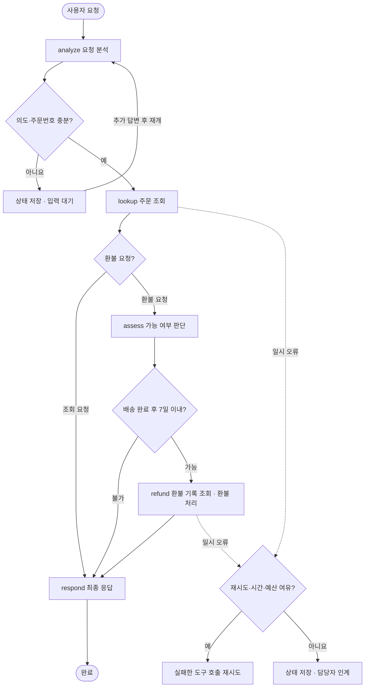

# 주문·환불 Workflow 설계서

## 업무 개요

| 항목 | 정의 |
|---|---|
| 목적 | 인증된 고객의 주문을 조회하고, 실습 환불 조건에 따라 처리·거절 안내 |
| 입력 | 고객 요청 문자열, 모의 인증 고객 C001 |
| 출력 | 최종 응답, 실행 로그, 체크포인트, 필요 시 담당자 확인 요청 파일 |
| 실습 업무 규칙 | 배송 완료 후 0~7일인 주문은 전액 환불 가능 |
| 완료 기준 | 조회 결과 안내, 환불 결과 확인 후 안내, 또는 사유를 포함한 환불 불가 안내 |
| 담당자 확인 | 주문 확인 불가, 재시도 소진, 예산·시간·단계 제한, 예상하지 못한 오류 |
| 범위 | 주문 1개, 전액 환불 1회, 로컬 모의 API |

위의 7일은 수업용 가상 정책이다. 실제 업체 약관이나 법적 환불 기준을 나타내지 않는다.

## 순서·분기·반복

도구 재시도는 해당 노드 안에서 일어난다. 입력 대기는 자동 반복하지 않는다. 업무 완료와 담당자 인계는 종료 상태다. 모든 단계 시작 전에 시간·단계 제한을, 모든 도구 호출 전에 시간·호출·비용·시도 제한을 검사한다.

## Task와 Node 매핑

| 작업 | Node | 읽는 State | 바꾸는 State | 다음 이동 |
|---|---|---|---|---|
| 의도와 주문번호 추출 | analyze | request, messages | intent, order_id, status, response | lookup / 입력 대기 |
| 해당 고객의 주문 조회 | lookup | order_id, customer_id | order | assess / respond |
| 업무 규칙 판정 | assess | order | eligible, reason | refund / respond |
| 기존 결과 조회·환불 | refund | order_id, customer_id | refund | respond |
| 결과 문장 생성 | respond | intent, order, refund, reason | response, status | end |

## Tool/API 계약

| Tool | 입력 | 출력 | 실패 |
|---|---|---|---|
| get_order | order_id, customer_id | 주문 ID·금액·배송 경과일·상태 | 일시 오류, timeout, 주문 확인 불가 |
| get_refund | order_id, customer_id | 환불번호·금액 또는 None | timeout, 주문 확인 불가 |
| create_refund | order_id, customer_id, idempotency_key | 환불 ID·금액 | 일시 오류, timeout, 업무 규칙 불충족 |

쓰기 API는 본인 주문 여부와 환불 조건을 다시 검사한다. 모의 인증 값은 고정 C001이다. 실제 인증 시스템은 구현하지 않는다.

## State와 실행 상태

업무 State는 요청·의도·주문·환불 가능 여부·사유·영수증·응답이다. 실행 State는 run_id, current_node, status, steps, tool_calls, cost_units, elapsed_s, attempts, last_error다.

| status | 의미 | 이후 동작 |
|---|---|---|
| running | 계속 실행할 노드가 있음 | Loop 또는 명시적 재개 |
| waiting_input | 정보가 부족함 | 체크포인트 저장 후 사용자 답변 대기 |
| completed | 완료 기준 충족 | 종료, 재개해도 도구를 다시 호출하지 않음 |
| escalated | 자동 처리를 계속할 수 없음 | 담당자 확인 요청 파일 생성 후 종료 |

## 실행 순서와 예외

정상 환불: analyze → lookup → assess → refund → respond.

환불 불가: analyze → lookup → assess → respond. `completed`는 고객 안내 업무가 완료됐다는 뜻이며 반드시 환불됐다는 뜻은 아니다.

재시도 가능 오류: `TransientError`, `TimeoutError`. 업무상 오류인 `ServiceError`는 즉시 담당자 확인으로 끝난다. 알 수 없는 의도·주문번호 누락·여러 주문번호는 입력 대기로 전환한다.

환불 성공 여부가 불명확할 때는 완료를 단정하지 않는다. 현재 재시도는 같은 멱등성 키를 사용하므로 환불 기록 DB에서 중복 저장을 방지한다. 재시작 시에는 영수증을 먼저 조회한다. 한도를 소진하면 담당자가 환불 기록을 확인하도록 인계한다. 체크포인트 저장과 외부 쓰기는 하나의 트랜잭션이 아니므로, JSON 저장만으로 exactly-once가 보장된다고 설명하지 않는다.

## 검증 기준

정상 환불은 DB에 환불 기록 1건이 저장되고 API 응답으로 환불번호·금액이 확인되어야 한다. 거절·조회·타인 주문은 환불 기록이 늘지 않아야 한다. 재시도 횟수는 최초 시도를 포함해 최대 3회다. 비용은 실패 호출에도 누적되고, 한도를 넘는 호출은 시작되지 않아야 한다. timeout 후 DB에 환불 기록이 있어도 영수증 응답을 확인하지 못했으면 성공으로 안내하면 안 된다. 체크포인트 복구와 새 요청 모두 같은 주문을 중복 환불하지 않아야 한다.

## Claude 요청 분석 계약

요청 분석은 `claude-sonnet-5`의 실제 API 호출이다. 입력은 고객 요청과 추가 답변(`messages`)이며 인증 고객 ID를 LLM에서 추출하지 않는다. 출력은 intent(lookup/refund/unknown), order_id(단일 번호 또는 빈 문자열)이다. 모델에는 Tool 실행 권한을 제공하지 않는다.

Python 검증 → State 갱신 → Routing 순으로 진행한다. unknown/번호 누락은 질문·대기, 모델 응답 오류는 담당자 확인 요청으로 구분한다. 이후 본인 주문 확인과 환불 규칙은 기존 Python·API가 담당한다.

실행 State에 llm_calls, input_tokens, output_tokens가 추가된다. LLM은 별도 호출·시간·입출력 크기 제한을 사용하고, Tool의 가상 비용과 실제 모델 요금은 구분한다.
